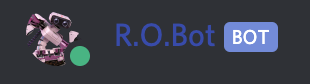
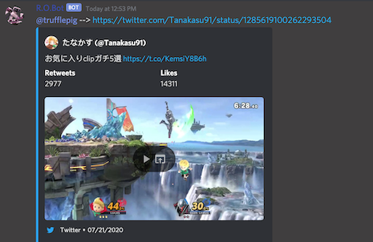
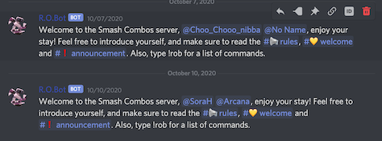

My friend from the coding school I attended built this awesome capstone project you can check out, [here.](https://github.com/Breadkenty/Smash_Combos)
He started a Discord server to interact with users and implement new features.

So I built him a basic Discord bot that greets new members to the server and links videos and images
depending on the command typed in the chat. I hosted the bot using Heroku, and utilized the fantastic
[discord.js](https://discord.js.org/#/) library.

I honestly wanted to spend more time on this bot and make him much more interactive, but there are already plenty of awesome bots that you can just invite to your server, no coding necessary. I didn't have the time I wanted to further develop R.O.Bot,
and server traffic was quite slow, so I had few testers. He's still active, though, and you can see him in action if you join the Discord server.

