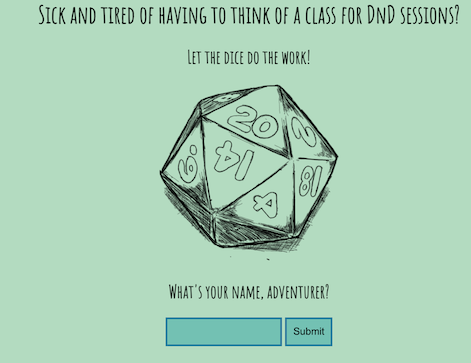
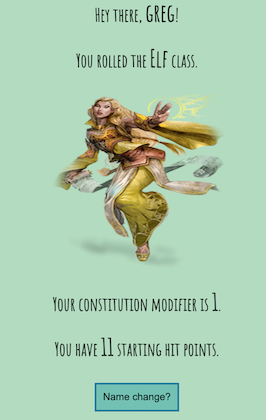

I didn't know anything about PHP before this project, but I applied for a junior PHP dev job, so I
figured I needed to learn. I had heard some pretty bad things about PHP before I used it, but I actually
enjoyed it. It seemed relatively easy enough to learn, and it's quicker than React, with a smaller bundle size.
There are definitely issues with storing the state though, as you can't dynamically change the state, you have to
store your state in a form submit function, then resubmit the form if you wish to change the state. I also tried to make this app mobile friendly for role-players on the go!

My inspiration for this project was actually a HackerRank coding challenge I saw in Javascript, and as I tested it I thought
it would be cool to randomize the process.

