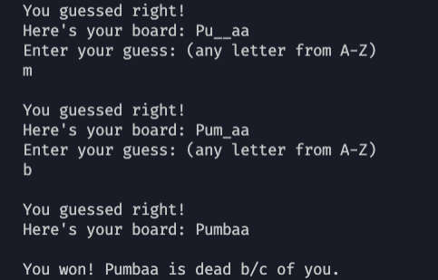
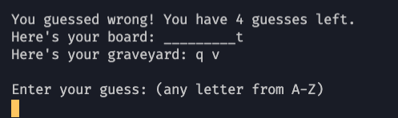

I was reading through the book, _Automate the Boring Stuff with Python_, and I wanted to make my own console app after completing some of the small exercises at the end of each of the chapters. I always liked the simplicity of hangman but I wanted my pool of words to be a little different. I decided on some of my favorite Disney characters growing up.

I realized after testing the app for awhile that even I couldn't usually think of the answer without looking at the array of characters, so I'd like to add some hints to help people guess for my next version of the app.

As (almost) always, the code for this app can be found on my Github, [here.](https://github.com/ejbee3/automate-the-boring-stuff-py/blob/master/hangman/hangman.py) Also, make sure you're using at least Python 3.6 if you want to test it out, as I used f-strings.
