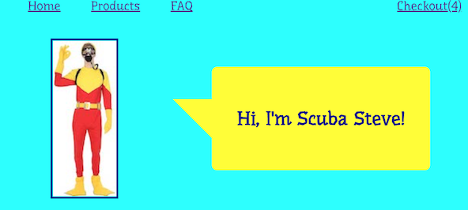
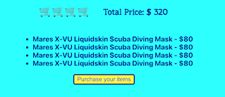
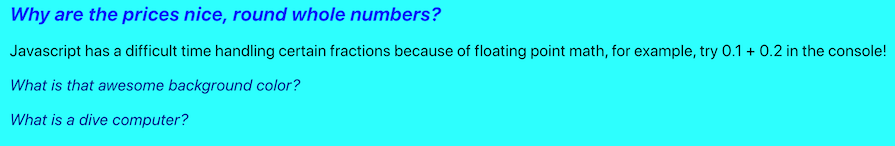

I made this website for a training program I was completing for Cognixia. It was a pretty open ended assignment, as
we were tasked with making a fictional company that sold some kind of product. I love SCUBA, and I fondly remember the movie _Big Daddy_ with Adam Sandler, so you can probably see where I drew my inspiration from.

Some features that I'm proud of:

- Use of the Unsplash API to randomly upload an ocean-themed picture on page load
- FAQ page that enlarges questions and shows/hides the answers on click
- Search bar for the products page
- Separate cart page that totals your items and "checks" them out

Next Steps for this app would be:

- Hooking the products up to a database to log inventory
- Sign in portal for users to save their carts and see order history
- General design updates to reduce whitespace
- UI testing by gathering feedback from users

