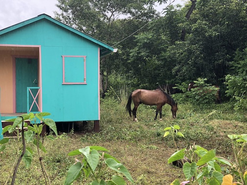
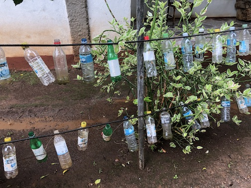
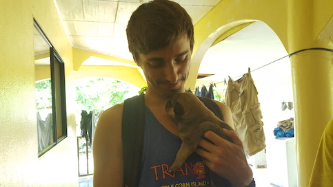

After graduating from Florida State University, I wanted to see a bit of the world. There was this really cool volunteer org
on campus called GIVE, and they were sponsoring trips to Little Corn Island, off the coast of Nicaragua. Not only did we get to interact with the locals and see some of their culture, but we also completed our PADI open water SCUBA certification.
I was part of a small group of divers and luckily, two of the divers brought GoPro's for some quality "footie":

<iframe width="560" height="315" src="https://www.youtube.com/embed/rjQAjPnzDH8" frameborder="0" allowfullscreen></iframe>

The island was beautiful, and you truly felt like you were in a microcosm removed from the hustle and bustle of society:

The locals did their best to make light of the sheer amount of trash that was dumped on the island constantly by the
mainland and Big Corn Island:

My divemaster was this wonderful British lady whose dog had a litter of puppies during my trip. One of the days of our
training she was up most of the night delivering them:

It was a great trip and it's one of my most cherished memories. Obviously, not everyone is able to travel and I was
extremely fortunate to have the opportunity. But if you are able to, most definitely do.
